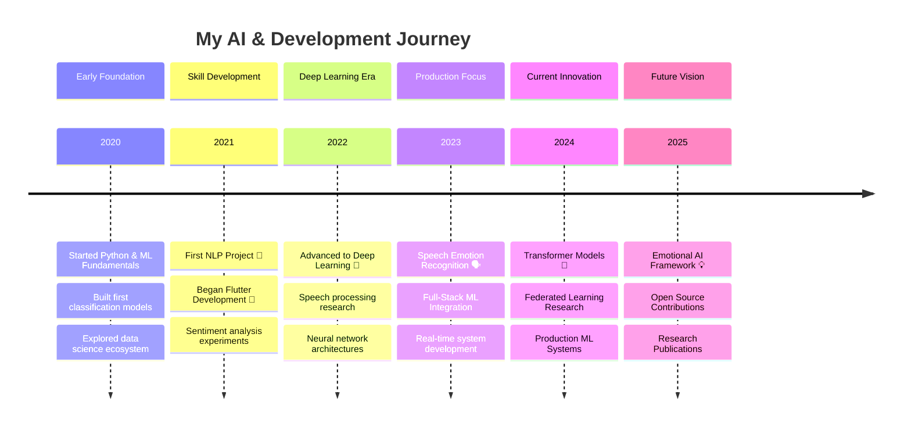

<div align="center">
  
</div>

<div align="center">
  
</div>

<div align="center">
  
</div>

<div align="center">
  
</div>

<div align="center">
  
</div>


## 🌟 About Me


```python
class PallavSharma:
    def __init__(self):
        self.name = "Pallav Sharma"
        self.title = "AI Researcher & ML Engineer"
        self.location = "Delhi, India 🇮🇳"
        self.passion = "Building emotional intelligence into AI systems"
        self.vision = "At the intersection of AI and human emotion, we find the future of technology"
        
    def current_focus(self):
        return {
            "🎯 Primary": "Advanced emotion recognition systems",
            "🎵 Secondary": "Music-based therapeutic applications", 
            "🔬 Research": "Transformer architectures & federated learning",
            "☁️ Infrastructure": "Cloud-native ML deployments"
        }
        
    def expertise(self):
        return [
            "🧠 Natural Language Processing",
            "🎭 Emotion AI & Affective Computing", 
            "🗣️ Speech Emotion Recognition",
            "💬 Sentiment Analysis",
            "🌐 Full-Stack Development"
        ]
```

<div align="center">
  
</div>


## 📊 GitHub Stats & Analytics
<div align="center">
  
  
  
</div>


<div align="center">
  
  
</div>

<div align="center">
  
</div>

<div align="center">
  
</div>


<div align="center">
  
</div>


## 🛠️ Technology Arsenal

<div align="center">
  
</div>

### 🧠 AI & Machine Learning
<div align="center">
  
  
  
  
  
  
</div>

### 🌐 Development Stack
<div align="center">
  
  
  
  
  
  
</div>

### ☁️ Cloud & DevOps
<div align="center">
  
  
  
  
  
</div>

<div align="center">
  
</div>

<div align="center">
  
</div>

## 💼 Professional Journey

<div align="center">



</div>


<div align="center">
  
</div>


## 🏆 Achievements & Recognition

<div align="center">
  
</div>

<div align="center">
  
</div>

## 🚀 Featured Projects

<div align="center">
  <table>
    <tr>
      <td width="50%">
        <h3 align="center">🎭 Voice Emotion Recognition System</h3>
        <div align="center">
          <a href="https://github.com/pallav110/voice-emotion" target="_blank">
            
          </a>
        </div>
        <p align="center">
          <strong>🎯 89% Accuracy</strong> • Deep learning system analyzing speech patterns using custom LSTM architecture and MEL spectrogram features
        </p>
        <div align="center">
          
          
          
        </div>
      </td>
      <td width="50%">
        <h3 align="center">🎵 Music Therapy AI</h3>
        <div align="center">
          <a href="https://github.com/pallav110/music-sentiment" target="_blank">
            
          </a>
        </div>
        <p align="center">
          <strong>🎶 65% Stress Reduction</strong> • Innovative app mapping emotions to musical features for enhanced well-being
        </p>
        <div align="center">
          
          
          
        </div>
      </td>
    </tr>
  </table>
</div>

<div align="center">
  
</div>

## 💼 Current Work & Focus

<div align="center">

```python
class CurrentProjects:
    def __init__(self):
        self.projects = {
            "🎭 Voice Emotion Recognition": {
                "progress": "80%",
                "tech_stack": ["PyTorch", "Librosa", "FastAPI", "Docker"],
                "goal": "Production-ready API for real-time emotion detection",
                "impact": "Healthcare & Customer Service Applications"
            },
            "🎵 Music Therapy Platform": {
                "progress": "60%", 
                "tech_stack": ["Flutter", "TensorFlow Lite", "Firebase", "Spotify API"],
                "goal": "Beta launch Q3 2025",
                "impact": "Mental health support through personalized music"
            },
            "🔬 Multilingual NLP Research": {
                "progress": "Ongoing",
                "focus": "Emotion detection across languages",
                "collaboration": "Academic institutions",
                "goal": "Research publication in top-tier journal"
            }
        }
        
    def research_interests(self):
        return [
            "🧠 Transformer architectures for emotion understanding",
            "🌐 Federated learning for privacy-preserving AI",
            "🎯 Real-time affective computing systems",
            "🎨 Multimodal emotion recognition (text, speech, visual)"
        ]
```

</div>

<div align="center">
  
</div>

## 📝 Latest Content & Research

<div align="center">
  
</div>

📚 **Recent Publications & Blog Posts:**
- 🤖 [Transforming Emotion Recognition with Transformer Models](https://github.com/pallav110)
- 🔮 [The Future of Affective Computing in Human-Computer Interaction](https://github.com/pallav110)
- ⚡ [Implementing Real-time Speech Emotion Recognition Systems](https://github.com/pallav110)
- 📱 [Flutter and ML: Creating Cross-platform AI Applications](https://github.com/pallav110)

<div align="center">
  
</div>

## 🎵 Currently Listening To

<div align="center">
  
</div>


<div align="center">
  
</div>

## 🌟 Let's Connect & Collaborate!

<div align="center">
  
</div>

<div align="center">
  <table>
    <tr>
      <td align="center">
        <a href="mailto:pallavs2020@gmail.com">
          
          <br><strong>Email Me</strong>
        </a>
      </td>
      <td align="center">
        <a href="https://www.linkedin.com/in/pallav-sharma-3a474727b/">
          
          <br><strong>Connect on LinkedIn</strong>
        </a>
      </td>
      <td align="center">
        <a href="https://twitter.com/PallavAI">
          
          <br><strong>Follow on Twitter</strong>
        </a>
      </td>
    </tr>
  </table>
</div>

<div align="center">
  
</div>

## ⚡ Fun Facts & Interests

<div align="center">

```yaml
fun_facts:
  🎵 passion_project: "Emotional progression algorithm for music therapy"
  🧠 research_achievement: "65% stress reduction through personalized playlists"
  🎯 daily_routine: "Code, Music, Research, Repeat"
  🌟 philosophy: "Technology should enhance human emotions, not replace them"
  🎨 hobbies: ["Music Production", "AI Art", "Psychology Books", "Open Source"]
  ☕ fuel: "Coffee and curiosity about human emotions"
```

</div>

<div align="center">
  
</div>


<div align="center">
  
</div>

<div align="center">
  
</div>

---
